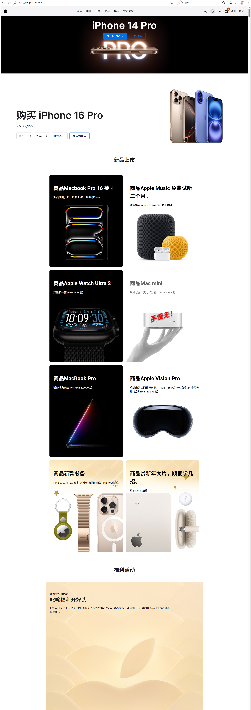
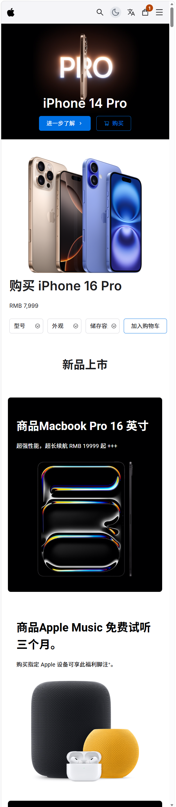

# 🍎 Black Apple

> Apple 风格设计的电商购物网站 — React + TypeScript 练手项目

🔗 **在线演示**：[https://ding123.website](https://ding123.website)

---

## ✨ 功能清单

- [x] 商品列表展示（Apple 风格 UI）
- [x] 购物车（增删改、数量调整、总价计算）
- [x] 用户登录/登出（模拟）
- [x] 关键词搜索商品
- [x] 中英文切换（i18n）
- [x] 暗色/亮色模式切换
- [x] 响应式设计（PC + iPad+手机适配）

---

## 🛠️ 技术栈

| 类别 | 技术 |
|------|------|
| 框架 | React 18 + TypeScript |
| 构建工具 | Vite |
| 路由 | React Router v6 |
| 国际化 | i18next |
| 部署 | Vercel |

---

## 🚀 本地启动

```bash
npm install
npm run dev

## 📱 截图

 


（特别说明：学习/练习项目，与 Apple 无关联）
